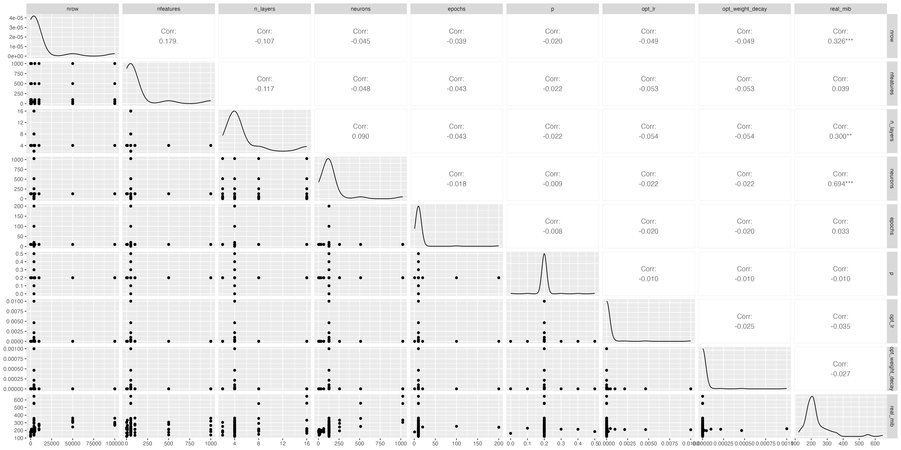
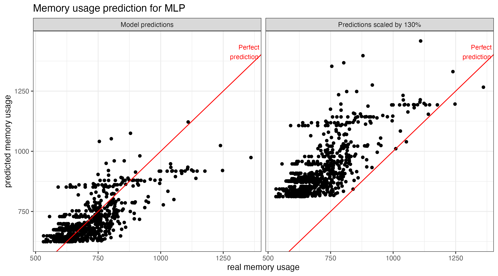
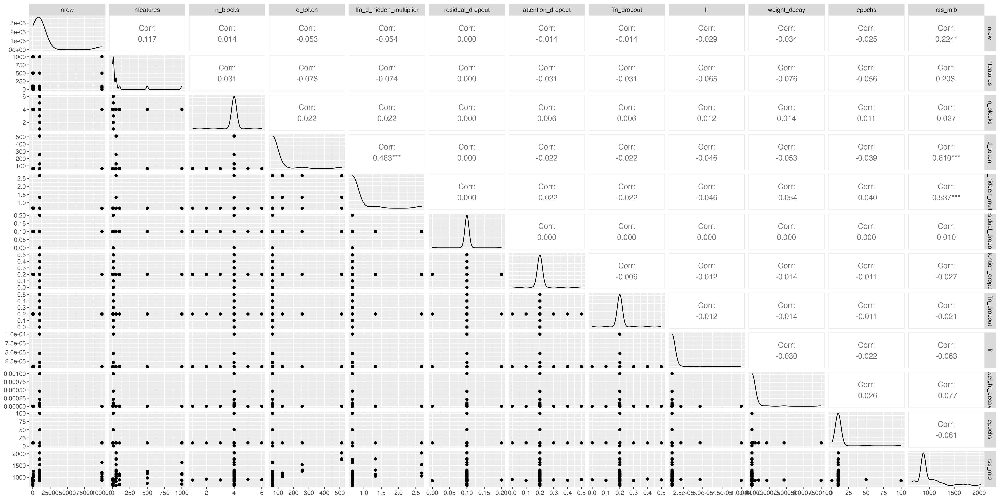
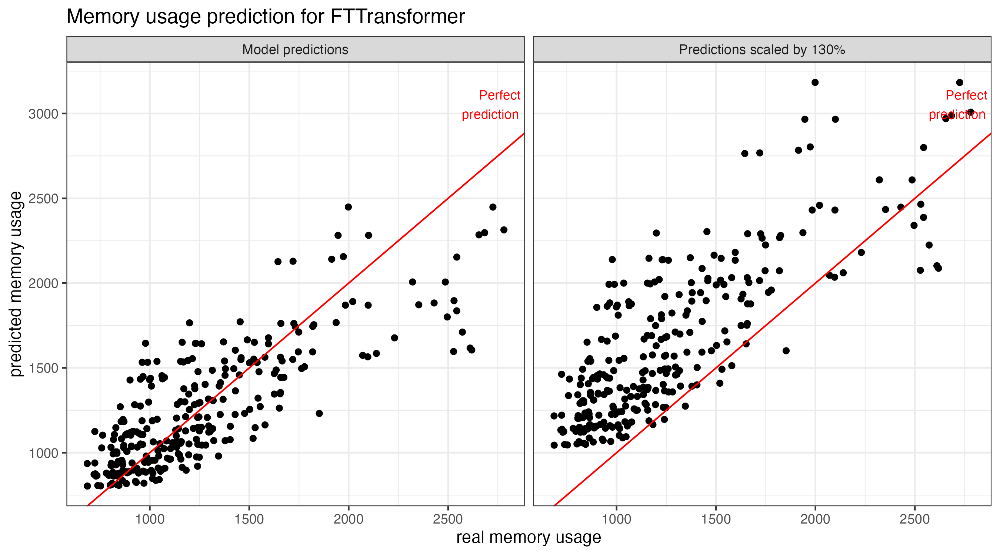
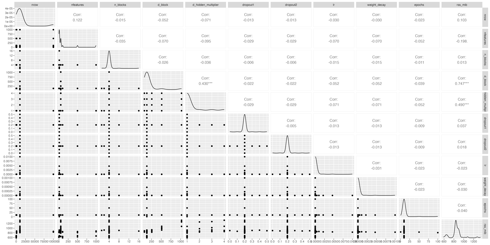
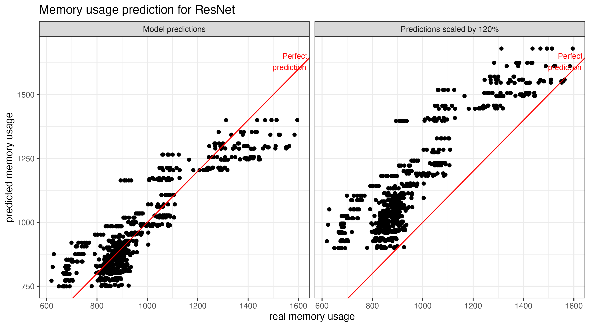

# Estimation of memory usage depending on learner hyperparameters and data size

## Usage and reproducibility

Each learner has its own subfolder with scripts and results.

### Files

- `learner_*.R`: one train + prediction run of the learner; copy the `learner` spec from the `graph` method of the corresponding `Auto*` file when adapting to a new learner.
- `memory_measure_*.sh`: runs memory measurements for a grid of hyperparameters.
- `parameters_*_csv_suffix.csv`: input grid for `memory_measure_*.sh`.
- `memory_result_*_csv_suffix.csv`: output measurements.
- `param_construction_*.R`: builds parameter grids.
- `param_analysis_*.R`: explores correlations and fits the Gamma GLM used for the final prediction formula.

### Reproduce

1. Generate or adjust a parameter grid with `param_construction_*.R`.
2. Run `chmod +x measure_memory_*.sh` once (if needed).
3. Run `memory_measure_*.sh grid` to produce `memory_result_*_grid.csv`.
4. Run `param_analysis_*.R` to fit the model and generate the plots.

### Method

I start from each learner's defined parameter set and do small-scale probes to identify which hyperparameters plausibly affect memory. I summarize results with basic statistics and correlations, then keep only the strongest predictors. Next, I run a refined grid over those hyperparameters, fit a Gamma GLM (memory is strictly positive), and scale predictions up by 20-30% to bias toward overestimation. The resulting coefficients go into the learner's `estimate_memory` function.

## Results

Data set sizes used:

- `nrow`: 10 to 100000 rows
- `nfeatures`: 1 to 1000 features

### `Mlp`

Correlation of data size and model hyperparameters with memory usage:

Correlates with memory usage:

- `nrow`: number of rows of the data set
- `n_layers`: network depth
- `neurons`: layer width

Formula to estimate memory: 

$$
\text{memory} = \exp\!\left(6.43 + 2 \times 10^{-7} \cdot \text{nrow} + 0.0053 \cdot \text{n\_layers} + 0.0003 \cdot \text{neurons}\right)
$$

The result is then scaled by 130% to overpredict in most cases:

### `FTTransformer`

Correlation of data size and model hyperparameters with memory usage:

Correlates with memory usage:

- `nrow`: number of rows of the data set
- `nfeatures`: number of features used to train the learner
- `d_token`: embedding dimension
- `ffn_d_hidden_multiplier`: width multiplier for hidden layers

Formula to estimate memory:

$$
\text{memory} = \exp\!\left(6.54 + 1.41 \times 10^{-6} \cdot \text{nrow} + 0.0004 \cdot \text{nfeatures} + 0.0013 \cdot \text{d\_token} + 0.11 \cdot \text{ffn\_d\_hidden\_multiplier}\right)
$$

The result is then scaled by 130% to overpredict in most cases:

### `ResNet`

Correlation of data size and model hyperparameters with memory usage:

Correlates with memory usage:

- `nrow`: number of rows of the data set (but only really small correlation)
- `d_block`: block width
- `d_hidden_multiplier`: hidden layer multiplier

Formula to estimate memory: 

$$
\text{memory} = \exp\!\left(6.56 + 8.35 \times 10^{-7} \cdot \text{nrow} + 0.00046 \cdot \text{d\_block} + 0.034 \cdot \text{d\_hidden\_multiplier}\right)
$$

The result is then scaled by 120% to overpredict in most cases:

### `Ranger`

Setup only, measurements pending.

Unlike the torch learners, the experiment uses synthetic data (standard normal features with signal on the first 5) instead of resampling `tsk("spam")`.
Sampling task features with `replace = TRUE` silently deduplicates, which caps `nfeatures` at the 57 unique spam features, and `nfeatures` matters for ranger through `mtry.ratio`.

Candidate predictors (forest memory should be roughly `num_trees * nrow * sample_fraction`, so `param_analysis_ranger.R` also fits the gamma GLM with logged covariates):

- `nrow`: number of rows of the data set
- `nfeatures`: number of features used to train the learner
- `num_trees`: number of trees
- `sample_fraction`: fraction of rows sampled per tree
- probes for `replace` and `mtry_ratio` in `parameters_ranger_no_influence.csv`

Grids:

- `parameters_ranger_test.csv`: one small config to test the pipeline.
- `parameters_ranger_no_influence.csv`: probes for `replace` and `mtry_ratio`.
- `parameters_ranger_grid.csv`: main grid (99 configs), `nrow` up to 100000, `nfeatures` up to 1000, capped at `nrow * nfeatures <= 5e7`.
- `parameters_ranger_large.csv`: 6 configs with default hyperparameters and up to 1000000 rows, because ranger runs on large data sets; run after the main grid.

A single-threaded reference config (50000 rows, 100 features, 500 trees, `sample.fraction = 1`) takes 13 minutes and peaks at 884 MiB.
Scaling by `nrow * nfeatures * num_trees * sample_fraction`, expect roughly 12 hours for the main grid and 6 hours for the large grid.
